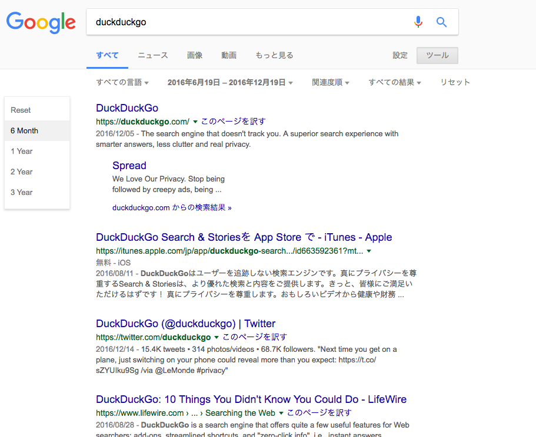

# quick-custom-gsearch

## What's this

This is a Chrome Extention.
You can access the control panel to manage interval quickly, just one click.

## Screenshot

## Installation

1. Clone this repository to any local directory.
2. Open <chrome://extensions/> in Your Chrome.
3. Click load-unpacked 
4. Select the path cloned
5. :smile:
